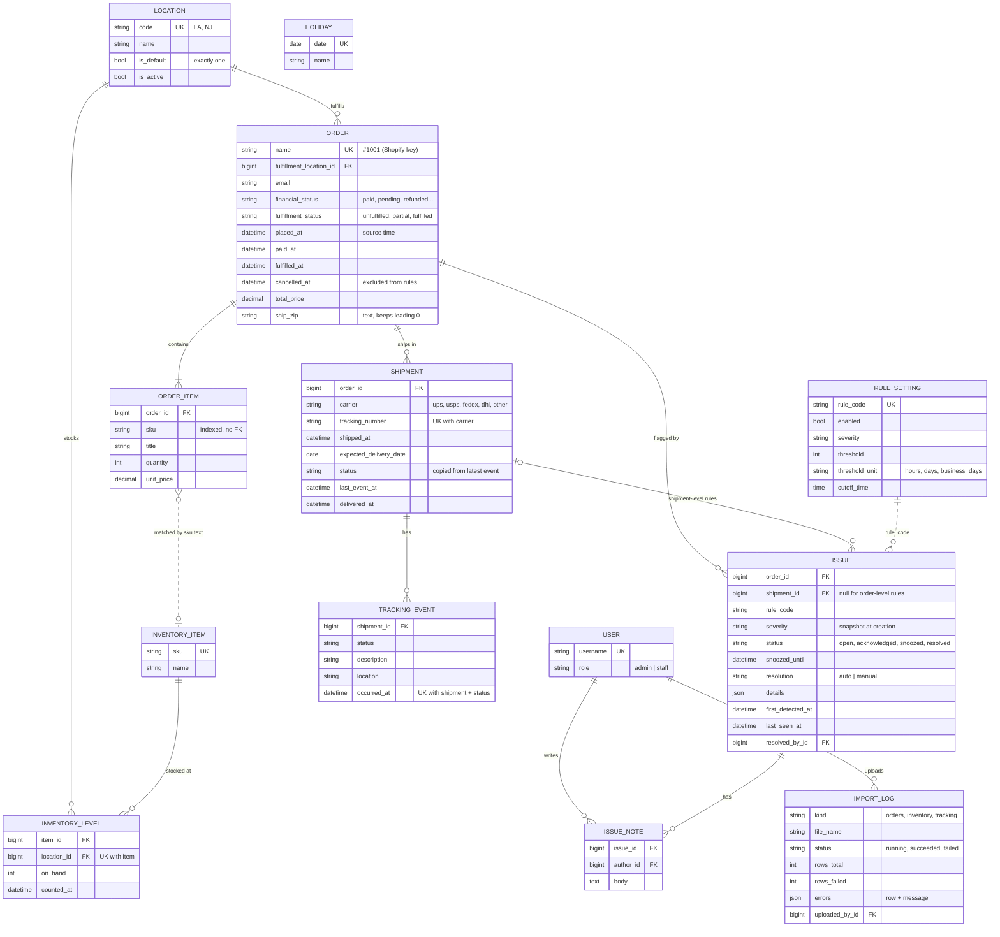

# Data model

Status: **approved design, October 2026.** Week 1 builds the location, inventory, order, shipment and import tables. Week 2 adds the issue (exception) tables used by the rules engine.

## Apps

| App | Models | Week |
|---|---|---|
| `accounts` | `User` | done |
| `inventory` | `Location`, `InventoryItem`, `InventoryLevel` | 1 |
| `orders` | `Order`, `OrderItem`, `Shipment`, `TrackingEvent` | 1 |
| `imports` | `ImportLog` (plus the CSV importers) | 1 |
| `issues` | `Issue`, `IssueNote`, `RuleSetting`, `Holiday` (plus the rules engine) | 2 |

Every table also has `created_at` and `updated_at`, set by ShipRadar. They are different from source timestamps such as `placed_at`, which come from the imported data.

## Week 1 tables

### `inventory.Location`

| Field | Type | Notes |
|---|---|---|
| `code` | text, unique | Short code, e.g. `LA`, `NJ` |
| `name` | text | e.g. "Los Angeles warehouse" |
| `is_default` | bool | Exactly one location is the default (partial unique index on `is_default = true`) |
| `is_active` | bool | Inactive locations keep their history but receive no new orders |

### `inventory.InventoryItem`

| Field | Type | Notes |
|---|---|---|
| `sku` | text, unique | The SKU master list |
| `name` | text | |

### `inventory.InventoryLevel`

| Field | Type | Notes |
|---|---|---|
| `item` | FK → InventoryItem, cascade | |
| `location` | FK → Location, protect | Unique together with `item`: one stock number per SKU per location |
| `on_hand` | int, ≥ 0 | |
| `counted_at` | datetime | When this stock level was true, from the inventory file |

The names follow Shopify's own vocabulary (`Location`, `InventoryItem`, `InventoryLevel`).

### `orders.Order`

| Field | Type | Notes |
|---|---|---|
| `name` | text, unique | Shopify order name, e.g. `#1001`. Re-importing a file updates the order with the same name instead of creating a duplicate |
| `fulfillment_location` | FK → Location, protect | The warehouse that ships the order. The importer uses the default location when the file has none |
| `email` | email | Customer email. No separate customer table |
| `financial_status` | choice | `pending`, `authorized`, `partially_paid`, `paid`, `partially_refunded`, `refunded`, `voided` |
| `fulfillment_status` | choice | `unfulfilled`, `partial`, `fulfilled` |
| `placed_at`, `paid_at`, `fulfilled_at`, `cancelled_at` | datetime, nullable except `placed_at` | Source times, stored in UTC |
| `currency` | text (3) | e.g. `USD` |
| `total_price` | decimal(12, 2) | Never float |
| `shipping_method` | text | |
| `ship_name`, `ship_address1`, `ship_address2`, `ship_city`, `ship_province`, `ship_zip`, `ship_country` | text | Flat, like the Shopify export. `ship_zip` is text so `02108` keeps its leading zero |

### `orders.OrderItem`

| Field | Type | Notes |
|---|---|---|
| `order` | FK → Order, cascade | |
| `sku` | text, indexed | Matched to `InventoryItem.sku` by text, not by foreign key (see decision 2) |
| `title` | text | Product title as it appeared on the order |
| `quantity` | positive int | |
| `unit_price` | decimal(12, 2) | |

### `orders.Shipment`

| Field | Type | Notes |
|---|---|---|
| `order` | FK → Order, cascade | An order can ship in several packages |
| `carrier` | choice | `ups`, `usps`, `fedex`, `dhl`, `other` |
| `tracking_number` | text, required | Unique together with `carrier` |
| `shipped_at` | datetime | |
| `expected_delivery_date` | date, nullable | Used by the late delivery rule |
| `status` | choice | `label_created`, `in_transit`, `out_for_delivery`, `delivered`, `exception`, `returned_to_sender`. Copied from the latest tracking event |
| `last_event_at` | datetime, nullable | Copied from the latest tracking event. Used by the stale tracking rule |
| `delivered_at` | datetime, nullable | |

### `orders.TrackingEvent`

| Field | Type | Notes |
|---|---|---|
| `shipment` | FK → Shipment, cascade | |
| `status` | choice | Same choices as `Shipment.status` |
| `description` | text | Carrier wording, e.g. "Delivery attempted, no access" |
| `location` | text | City and state where the event happened (free text, not a `Location`) |
| `occurred_at` | datetime | Unique together with `shipment` and `status`, so re-importing a tracking file adds nothing twice |

### `imports.ImportLog`

| Field | Type | Notes |
|---|---|---|
| `kind` | choice | `orders`, `inventory`, `tracking` |
| `file_name` | text | |
| `status` | choice | `running`, `succeeded`, `failed` |
| `rows_total`, `rows_created`, `rows_updated`, `rows_failed` | int | |
| `errors` | JSON list | `{"row": 12, "message": "Unknown carrier 'ontrac'"}` |
| `uploaded_by` | FK → User, nullable, protect | Empty when run from the command line |
| `started_at`, `finished_at` | datetime | |

## Week 2 tables

### `issues.Issue`

| Field | Type | Notes |
|---|---|---|
| `order` | FK → Order, cascade | |
| `shipment` | FK → Shipment, nullable, cascade | Set for shipment-level rules, empty for order-level rules (table below) |
| `rule_code` | choice | `overdue_unfulfilled`, `stockout`, `delivery_exception`, `missing_tracking`, `stale_tracking`, `late_delivery`, `suspicious_address` |
| `severity` | choice | `high`, `medium`, `low`. Copied from the rule when the issue is created |
| `status` | choice | `open`, `acknowledged`, `snoozed`, `resolved` |
| `snoozed_until` | datetime, nullable | |
| `resolution` | choice, nullable | `auto` (condition cleared) or `manual` (closed by a person) |
| `details` | JSON | Rule-specific facts, e.g. `{"sku": "GEL-102", "location": "LA", "short_by": 4, "available_elsewhere": {"NJ": 10}}` |
| `first_detected_at`, `last_seen_at`, `resolved_at` | datetime | |
| `resolved_by` | FK → User, nullable, protect | |

| Level | Rules | One open issue per |
|---|---|---|
| Order | `overdue_unfulfilled`, `stockout`, `missing_tracking`, `suspicious_address` | order + rule |
| Shipment | `delivery_exception`, `stale_tracking`, `late_delivery` | shipment + rule |

Constraint: unique `(order, shipment, rule_code)` while status is `open`, `acknowledged` or `snoozed`, with `nulls_distinct=False`. PostgreSQL normally treats every NULL as different, so without that flag two open order-level issues (both with `shipment = NULL`) would not conflict and duplicates would slip through.

### `issues.IssueNote`

| Field | Type | Notes |
|---|---|---|
| `issue` | FK → Issue, cascade | |
| `author` | FK → User, protect | Users are deactivated, not deleted, so notes keep their author |
| `body` | text | |

### `issues.RuleSetting`

| Field | Type | Notes |
|---|---|---|
| `rule_code` | choice, unique | One row per rule |
| `enabled` | bool | |
| `severity` | choice | |
| `threshold` | int, nullable | e.g. `2` |
| `threshold_unit` | choice, nullable | `hours`, `days`, `business_days` |
| `cutoff_time` | time, nullable | Only for `overdue_unfulfilled`: orders after this time count from the next business day |

### `issues.Holiday`

| Field | Type | Notes |
|---|---|---|
| `date` | date, unique | Skipped when counting business days |
| `name` | text | e.g. Thanksgiving |

## Design decisions

1. **Shopify's order name is the import key.** Importing the same file twice updates rows instead of duplicating them.
2. **SKUs link by text, not by foreign key.** Imported data is messy. A foreign key would reject an order whose SKU is missing from inventory; ShipRadar imports it and flags it instead. A SKU with no inventory row counts as zero stock.
3. **Every order has a fulfillment location.** The stockout rule allocates stock per location and SKU, oldest paid order first. When a location is short, the issue also lists stock available at other locations, so Ops can reassign the order or request a transfer.
4. **Shipments always have a tracking number.** "Missing tracking" means a fulfilled order with no shipment, so there is no half-empty shipment row.
5. **`Shipment.status` and `last_event_at` are copied from the latest event.** Rules and the queue read one row instead of searching every event. The importer updates both in the same transaction as the event.
6. **Shipment-level rules create one issue per package.** Two packages from one order can fail in different ways and be handled by different carriers.
7. **Cancelled orders are ignored by every rule.**
8. **The model is called `Issue`, not `Exception`.** `Exception` is a built-in Python class; reusing the name would shadow it. The UI still says "Exceptions".
9. **Money uses `Decimal`, ZIP codes use text, times are stored in UTC.**

## Out of scope

- Bin or shelf locations inside a warehouse
- Stock transfers between locations
- Automatic order routing (choosing the best location)
- Returns and refund workflows
- A separate customer table
- Writing anything back to Shopify
